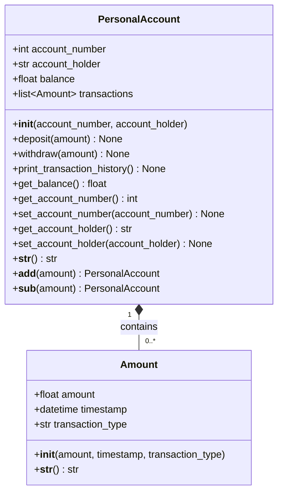

# UML Class Diagram: Personal Account Management

```mermaid
classDiagram
    class Amount {
        +float amount
        +datetime timestamp
        +str transaction_type
        +__init__(amount, timestamp, transaction_type)
        +__str__() str
    }

    class PersonalAccount {
        +int account_number
        +str account_holder
        +float balance
        +list~Amount~ transactions
        +__init__(account_number, account_holder)
        +deposit(amount) None
        +withdraw(amount) None
        +print_transaction_history() None
        +get_balance() float
        +get_account_number() int
        +set_account_number(account_number) None
        +get_account_holder() str
        +set_account_holder(account_holder) None
        +__str__() str
        +__add__(amount) PersonalAccount
        +__sub__(amount) PersonalAccount
    }

    PersonalAccount "1" *-- "0..*" Amount : contains
```
